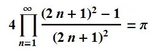
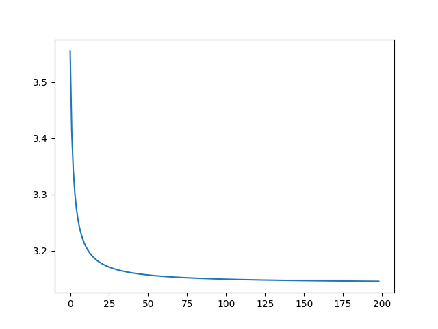

# 2025-1-파이썬 수업
이용희 교수님
## 목표
1. 머신러닝을 잘 하기위한 파이썬 프로그래밍
2. 객체지향개념을 연습하는 파이썬 프로그래밍
3. ADP, ADsP실기시험을 위한 파이썬 프로그래밍
4. 코딩테스트 연습

## Github와 파이참의 연동실험
파이참의 파일 메뉴 -> 버전관리에 있는 프로젝트 -> GitHub 선택 
-> 원하는 리파지토리 선택 (2025-1-python-class) -> 원하는 디렉토리 선택
-> **복제 선택**

## 변수와 자료형
 - 정수 int
 - 실수 float
 - 문자열 str
 - 논리형 bool

## 리스트 
 한 개의 변수에 여러 값을 할당
 - 인덱싱 ,슬라이싱
 - 리스트의 연산 - 덧셈, 곱셈, append, insert, remove

## 조건문
 - if
 - else
 - elif

## 반복문
 - for
 - while

# 프로젝트1 : 파이 값 구하기
파이 값을 구하고 그래프로 그림
 - 
```
i = 1
pilist = []
for j in range(1,1000):
    i = i * ((2 * j + 1) ** 2 - 1) / (2 * j + 1) ** 2
    # print(i*4, ',')
    pilist.append(i*4)

import matplotlib.pyplot as plt
plt.plot(pilist)
plt.show()
```
- 